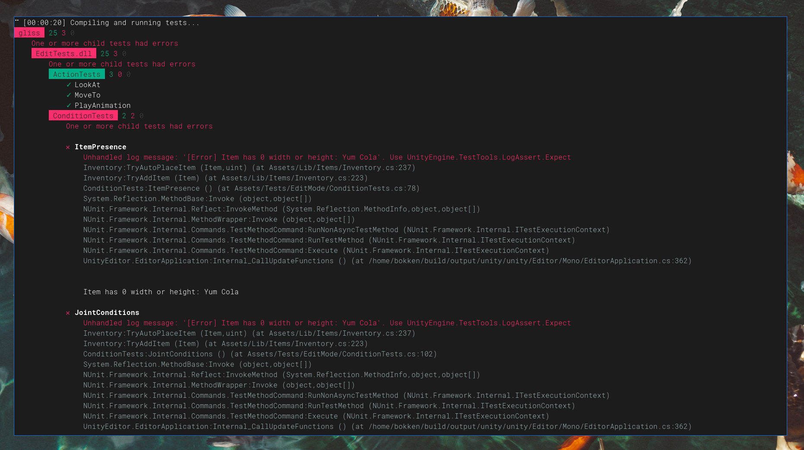

# unitool

A small tool to make it easier to develop on Unity without needing the Editor open.

All it does is two things:

```
# Compile the project, output any errors
unitool compile /path/to/unity/project

# Run unit tests and display results
# Supports optional filters with `-f`
# And can also specify the assemblies to include with `-a`
#   (defaults to "EditTests;PlayTest", which are the two
#   test assemblies I have defined).
unitool test /path/to/unity/project -m [edit-mode|play-mode]
```


